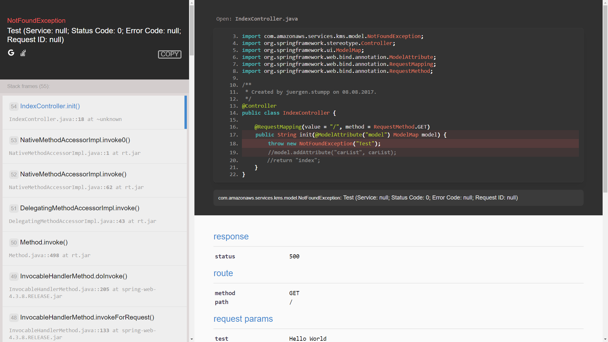

# Uups! <a href='https://search.maven.org/search?q=g:com.github.jstumpp%20a:uups'></a>

Pretty error page for Java Web apps (Spring Boot, Javalin, ...) that helps you debug your web application in the browser. Because stacktraces can be hard to read in the console!
 * See request parameters, headers, route, session and response status
 * Full Stacktrace
 * Source Code preview
 * Open file in IntelliJ IDEA exactly where the exception was thrown



## Dependency

### Maven
```xml
<dependency>
    <groupId>com.github.jstumpp</groupId>
    <artifactId>uups</artifactId>
    <version>0.1.1</version>
</dependency>
```
### Gradle
```groovy
compile('com.github.jstumpp:uups:0.1.1')
```

## Usage
### With a servlet engine, e.g. Javalin

```java
Javalin app = Javalin.create().start();

app.exception(Exception.class, (e, ctx) -> {
    ctx.html(Uups.renderHtml(e, ctx.status(), ctx.method(), ctx.path(), ctx.req));
});
```

### With Spring boot
To utilize, implement an ErrorController in your project:
```java
import com.github.jstumpp.uups.Uups;
import org.springframework.beans.factory.annotation.Autowired;
import org.springframework.boot.autoconfigure.web.ErrorAttributes;
import org.springframework.boot.autoconfigure.web.ErrorController;
import org.springframework.web.bind.annotation.RequestMapping;
import org.springframework.web.bind.annotation.RestController;

import javax.servlet.http.HttpServletRequest;
import javax.servlet.http.HttpServletResponse;
import java.io.IOException;

@RestController
public class DefaultErrorController implements ErrorController {

    private static final String PATH = "/error";

    @Autowired
    private ErrorAttributes errorAttributes;

    @RequestMapping(value = PATH)
    public String error(HttpServletRequest request, HttpServletResponse response) {
        RequestAttributes requestAttributes = new ServletRequestAttributes(request);
        Throwable cause = errorAttributes.getError(requestAttributes);
        Map errorAtt = errorAttributes.getErrorAttributes(requestAttributes, false);
        return Uups.renderHtml(cause, response.getStatus(), request.getMethod(), errorAtt.get("path").toString(), request);
    }

    @Override
    public String getErrorPath() {
        return PATH;
    }
}
```

## Notes:

* This handler reveals server internals and possibly code. Only install it when you are developing and make sure to disable it before pushing to production.
* Finding code snippets is an imperfect art since the original file locations are not preserved in the compiled bytecode. Thus, by default code snippets will only be displayed if the Java source file for the corresponding exception stack frame is available within the working directory under `src/main/java` or `src/main/test` and you are properly following the Java naming and directory structure conventions.

## Credits:

Based on [jooby/whoops](https://github.com/jooby-project/jooby/tree/master/modules/jooby-whoops) and [filp/whoops](http://filp.github.io/whoops/).
